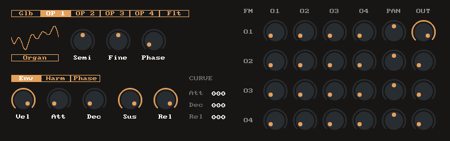

# JSModulator

Polyphonic FM synth with 4 operators

Features:
* 4 wavetable operators with additive synthesis
* FM matrix 4x4
* Global envelope and envelope per operator
* Operator harmonics and phase editor
* Filter per voice with envelope ADSR
* Envelope curve/tension controls

Available on ReaPack